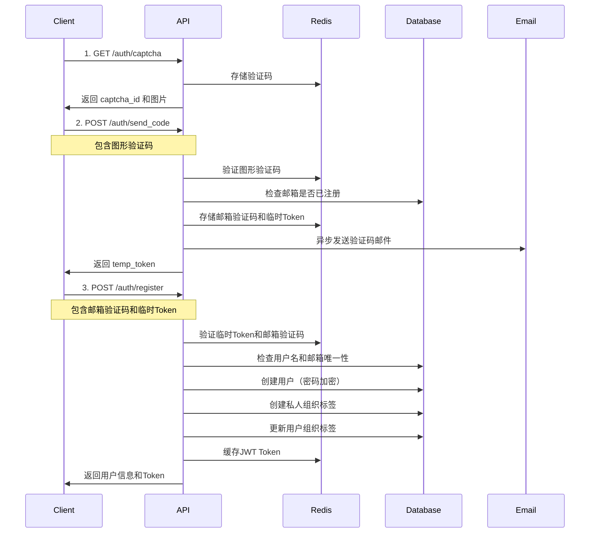

# 用户模块文档

## 目录

- [模块概述](#模块概述)
- [数据库模型](#数据库模型)
- [核心功能](#核心功能)
- [API 接口](#api-接口)
- [安全特性](#安全特性)
- [使用流程](#使用流程)
- [错误码说明](#错误码说明)

## 模块概述

用户模块是系统的核心认证和授权模块，提供用户注册、登录、信息管理等功能。模块支持基于 JWT 的认证机制，集成组织标签管理，实现细粒度的权限控制。

### 主要特性

- 用户注册与登录认证
- JWT Token 机制（支持 Redis 缓存验证）
- 组织标签关联管理
- 图形验证码与邮箱验证码双重验证
- 速率限制保护
- 密码加密存储（BCrypt）

### 技术栈

- **ORM**: SQLAlchemy (异步)
- **验证**: Pydantic
- **认证**: JWT (PyJWT)
- **缓存**: Redis (aioredis)
- **密码加密**: BCrypt

## 数据库模型

### User 模型

位置：`app/models/user.py`

#### 字段说明

| 字段名 | 类型 | 约束 | 说明 |
|--------|------|------|------|
| id | BigInteger | PK, 自增 | 用户唯一标识 |
| username | String(255) | 唯一, 非空, 索引 | 用户名 |
| email | String(255) | 唯一, 非空, 索引 | 邮箱地址 |
| password | String(255) | 非空 | 加密后的密码（BCrypt） |
| role | Enum(UserRole) | 非空, 默认 USER | 用户角色：USER, ADMIN |
| org_tags | String(255) | 可空 | 组织标签列表（逗号分隔） |
| primary_org | String(50) | 可空 | 主组织标签 |
| created_at | DateTime | 非空, 默认 now() | 创建时间 |
| updated_at | DateTime | 非空, 自动更新 | 更新时间 |

#### UserRole 枚举

```python
class UserRole(enum.Enum):
    USER = "USER"    # 普通用户
    ADMIN = "ADMIN"  # 管理员
```

### 组织标签关联

用户注册时会自动创建私人组织标签，格式为：`PRIVATE_{username}`，并自动设置为用户的主组织。

## 核心功能

### 1. 用户注册流程

1. 获取图形验证码
2. 发送邮箱验证码（需要图形验证码）
3. 提交注册信息（用户名、邮箱、密码、验证码）
4. 系统自动创建用户和私人组织标签
5. 返回 JWT Token（自动登录）

### 2. 用户登录流程

1. 提交用户名和密码
2. 系统验证密码（BCrypt）
3. 加载用户组织标签信息
4. 生成包含用户信息的 JWT Token
5. Token 缓存到 Redis（支持快速验证和撤销）

### 3. 组织标签管理

- 每个用户注册时自动创建私人组织标签
- 支持管理员为用户分配多个组织标签
- 支持设置主组织标签
- 组织标签信息包含在 JWT Token 中

## API 接口

### 1. 获取图形验证码

**接口路径**: `GET /api/v1/auth/captcha`

**功能说明**: 获取图形验证码，用于后续发送邮箱验证码时的验证。

**请求参数**: 无

**响应示例**:
```json
{
  "captcha_id": "550e8400-e29b-41d4-a716-446655440000",
  "captcha_image": "data:image/png;base64,iVBORw0KGgoAAAANS..."
}
```

**字段说明**:
- `captcha_id`: 验证码ID，用于后续验证
- `captcha_image`: Base64 编码的图片数据

**速率限制**: 每 IP 每分钟最多 10 次

**有效期**: 验证码有效期 5 分钟（存储在 Redis）

---

### 2. 发送邮箱验证码

**接口路径**: `POST /api/v1/auth/send_code`

**功能说明**: 向指定邮箱发送验证码，需要先通过图形验证码验证。

**请求体**:
```json
{
  "email": "user@example.com",
  "captcha_id": "550e8400-e29b-41d4-a716-446655440000",
  "captcha_code": "A3B9"
}
```

**响应示例**:
```json
{
  "temp_token": "eyJhbGciOiJIUzI1NiIsInR5cCI6IkpXVCJ9...",
  "message": "验证码已发送到您的邮箱，有效期5分钟"
}
```

**字段说明**:
- `email`: 邮箱地址（必须是有效的邮箱格式）
- `captcha_id`: 图形验证码ID
- `captcha_code`: 图形验证码文本
- `temp_token`: 临时令牌，注册时需要提交

**业务逻辑**:
1. 验证图形验证码是否正确
2. 检查邮箱是否已被注册
3. 速率限制检查（每邮箱每分钟最多 3 次）
4. 生成临时 Token（JWT，有效期 10 分钟）
5. 生成 6 位数字验证码
6. 验证码存储到 Redis（有效期 5 分钟）
7. 异步发送邮件

**速率限制**: 每邮箱每分钟最多 3 次

**错误响应**:
- `400`: 图形验证码错误
- `400`: 邮箱已被注册
- `429`: 请求过于频繁

---

### 3. 用户注册

**接口路径**: `POST /api/v1/auth/register`

**功能说明**: 注册新用户，注册成功后自动创建私人组织标签并返回 JWT Token。

**请求体**:
```json
{
  "username": "testuser",
  "email": "user@example.com",
  "password": "password123",
  "email_code": "123456",
  "temp_token": "eyJhbGciOiJIUzI1NiIsInR5cCI6IkpXVCJ9..."
}
```

**响应示例**:
```json
{
  "id": 1,
  "username": "testuser",
  "email": "user@example.com",
  "access_token": "eyJhbGciOiJIUzI1NiIsInR5cCI6IkpXVCJ9...",
  "token_type": "bearer",
  "message": "注册成功"
}
```

**字段说明**:
- `username`: 用户名（3-50 字符，唯一）
- `email`: 邮箱地址（唯一）
- `password`: 密码（6-50 字符，明文传输，后端 BCrypt 加密存储）
- `email_code`: 邮箱验证码（6 位数字）
- `temp_token`: 临时令牌（发送验证码时返回）

**业务逻辑**:
1. 速率限制检查（每 IP 每分钟最多 5 次）
2. 验证临时 Token 有效性和邮箱匹配
3. 验证邮箱验证码
4. 检查用户名和邮箱是否已存在
5. 创建用户记录（密码 BCrypt 加密）
6. 创建私人组织标签（`PRIVATE_{username}`）
7. 设置用户的组织标签和主组织
8. 生成 JWT Token（包含用户信息和组织标签）
9. 返回用户信息和 Token

**速率限制**: 每 IP 每分钟最多 5 次

**错误响应**:
- `400`: 临时令牌无效或已过期
- `400`: 邮箱验证码错误或已过期
- `400`: 邮箱已被注册
- `400`: 用户名已存在
- `429`: 请求过于频繁

---

### 4. 用户登录

**接口路径**: `POST /api/v1/auth/login`

**功能说明**: 用户登录，验证用户名和密码，返回 JWT Token。

**请求体**:
```json
{
  "username": "testuser",
  "password": "password123"
}
```

**响应示例**:
```json
{
  "access_token": "eyJhbGciOiJIUzI1NiIsInR5cCI6IkpXVCJ9...",
  "token_type": "bearer",
  "user_id": 1,
  "username": "testuser",
  "email": "user@example.com"
}
```

**字段说明**:
- `username`: 用户名（3-50 字符）
- `password`: 密码（明文传输）

**业务逻辑**:
1. 根据用户名查询用户
2. 验证密码（BCrypt 比对）
3. 从数据库加载用户组织标签信息
4. 生成 JWT Token（包含 userId、role、orgTags、primaryOrg 等）
5. Token 缓存到 Redis（支持快速验证和撤销）
6. 返回 Token 和用户基本信息

**错误响应**:
- `401`: 用户名或密码错误

---

### 5. 获取当前用户信息

**接口路径**: `GET /api/v1/auth/me`

**功能说明**: 获取当前登录用户的详细信息，包括组织标签信息。

**请求头**:
```
Authorization: Bearer <JWT_TOKEN>
```

**响应示例**:
```json
{
  "code": 200,
  "message": "Success",
  "data": {
    "id": 1,
    "username": "testuser",
    "role": "USER",
    "orgTags": ["PRIVATE_testuser", "dept1"],
    "primaryOrg": "PRIVATE_testuser"
  }
}
```

**字段说明**:
- `id`: 用户ID
- `username`: 用户名
- `role`: 用户角色（USER 或 ADMIN）
- `orgTags`: 组织标签列表（从逗号分隔字符串转换）
- `primaryOrg`: 主组织标签

**认证要求**: 需要有效的 JWT Token

**错误响应**:
- `401`: 未授权（Token 无效或已过期）

---

### 6. 获取用户列表

**接口路径**: `GET /api/v1/auth/users`

**功能说明**: 分页查询用户列表，支持关键词搜索和组织标签筛选。

**请求头**:
```
Authorization: Bearer <JWT_TOKEN>
```

**查询参数**:
- `page`: 页码（从 1 开始，默认 1）
- `size`: 每页条数（默认 20）
- `keyword`: 搜索关键词（可选，搜索用户名或邮箱）
- `orgTag`: 组织标签筛选（可选）

**请求示例**:
```
GET /api/v1/auth/users?page=1&size=20&keyword=test&orgTag=dept1
```

**响应示例**:
```json
{
  "code": 200,
  "message": "Get users successful",
  "data": {
    "content": [
      {
        "userId": 1,
        "username": "testuser",
        "email": "user@example.com",
        "orgTags": ["PRIVATE_testuser", "dept1"],
        "primaryOrg": "PRIVATE_testuser",
        "createTime": "2024-01-01T12:00:00Z"
      }
    ],
    "totalElements": 100,
    "totalPages": 5,
    "size": 20,
    "number": 0
  }
}
```

**字段说明**:
- `content`: 用户列表
  - `userId`: 用户ID
  - `username`: 用户名
  - `email`: 邮箱
  - `orgTags`: 组织标签列表
  - `primaryOrg`: 主组织标签
  - `createTime`: 创建时间
- `totalElements`: 总记录数
- `totalPages`: 总页数
- `size`: 每页大小
- `number`: 当前页码（从 0 开始）

**认证要求**: 需要有效的 JWT Token

**筛选逻辑**:
- 关键词搜索：模糊匹配用户名或邮箱
- 组织标签筛选：匹配 `org_tags` 字段或 `primary_org` 字段
- 结果按创建时间倒序排列

---

## 安全特性

### 1. 密码安全

- 使用 BCrypt 算法加密存储密码
- 密码强度要求：6-50 字符
- 明文密码仅在传输时使用，不存储在数据库中

### 2. JWT Token 机制

- Token 包含用户基本信息（userId、username、role）
- Token 包含组织标签信息（orgTags、primaryOrg）
- Token 签名验证（HS256）
- Token 过期时间：默认 7 天（可配置）
- Token 缓存到 Redis，支持快速验证和撤销

**Token Claims 结构**:
```json
{
  "tokenId": "uuid",
  "role": "USER",
  "userId": "1",
  "sub": "testuser",
  "orgTags": "PRIVATE_testuser,dept1",
  "primaryOrg": "PRIVATE_testuser",
  "exp": 1704067200,
  "iat": 1703462400
}
```

### 3. 速率限制

- **图形验证码**: 每 IP 每分钟最多 10 次
- **邮箱验证码**: 每邮箱每分钟最多 3 次
- **用户注册**: 每 IP 每分钟最多 5 次

速率限制基于 Redis 实现，防止恶意请求和暴力破解。

### 4. 双重验证

注册流程包含两层验证：
1. **图形验证码**: 防止自动化脚本
2. **邮箱验证码**: 验证邮箱所有权

### 5. 临时 Token 机制

发送邮箱验证码时会生成临时 Token（JWT），有效期 10 分钟。注册时必须提交有效的临时 Token，确保用户完成了图形验证码验证流程。

---

## 使用流程

### 完整注册流程



### 登录流程

```
1. 客户端发送用户名和密码
2. 服务器验证密码（BCrypt）
3. 从数据库加载用户信息和组织标签
4. 生成 JWT Token（包含用户和组织信息）
5. Token 缓存到 Redis
6. 返回 Token 给客户端
7. 客户端后续请求携带 Token
8. 服务器从 Redis 或 JWT 验证 Token
```

---

## 错误码说明

### HTTP 状态码

| 状态码 | 说明 | 使用场景 |
|--------|------|----------|
| 200 | 成功 | 请求成功处理 |
| 400 | 请求错误 | 参数验证失败、业务逻辑错误 |
| 401 | 未授权 | Token 无效或已过期 |
| 403 | 禁止访问 | 权限不足 |
| 404 | 未找到 | 资源不存在 |
| 409 | 冲突 | 资源冲突（如用户名已存在） |
| 422 | 参数验证失败 | Pydantic 验证失败 |
| 429 | 请求过多 | 触发速率限制 |
| 500 | 服务器错误 | 内部服务器错误 |

### 业务错误码

部分接口使用统一的错误响应格式：

```json
{
  "success": false,
  "code": "ERROR_CODE",
  "message": "错误描述",
  "data": null
}
```

### 常见错误场景

#### 注册相关

- **用户名已存在**: `400 - 用户名已存在`
- **邮箱已被注册**: `400 - 该邮箱已被注册`
- **图形验证码错误**: `400 - 图形验证码错误`
- **邮箱验证码错误**: `400 - 邮箱验证码错误`
- **临时Token无效**: `400 - 临时令牌无效或已过期`
- **请求过于频繁**: `429 - 请求过于频繁`

#### 登录相关

- **用户名或密码错误**: `401 - 用户名或密码错误`
- **Token无效**: `401 - Unauthorized`

#### 认证相关

- **Token缺失**: `401 - Unauthorized`
- **Token过期**: `401 - Unauthorized`
- **Token格式错误**: `401 - Unauthorized`

---

## 组织标签集成

### 自动创建私人组织

用户注册时会自动：
1. 创建组织标签（tag_id: `PRIVATE_{username}`）
2. 设置标签名称为：`我的组织-{username}`
3. 将标签设置为用户的主组织标签
4. 将标签添加到用户的组织标签列表

### JWT Token 中的组织信息

Token 中包含以下组织相关字段：
- `orgTags`: 组织标签列表（逗号分隔字符串）
- `primaryOrg`: 主组织标签

这些信息在 Token 生成时自动从数据库加载并写入，后续请求可以直接从 Token 中提取，无需查询数据库。

---

## 配置说明

### 环境变量

相关配置位于 `app/core/config.py`：

- `SECRET_KEY`: JWT 签名密钥
- `ALGORITHM`: JWT 算法（默认 HS256）
- `ACCESS_TOKEN_EXPIRE_DAYS`: Token 过期天数（默认 7）
- `TEMP_TOKEN_EXPIRE_MINUTES`: 临时Token过期分钟数（默认 10）
- `CAPTCHA_EXPIRE_SECONDS`: 图形验证码过期时间（默认 300）
- `EMAIL_CODE_EXPIRE_SECONDS`: 邮箱验证码过期时间（默认 300）

### Redis 键命名

- `captcha:{captcha_id}`: 图形验证码
- `email_code:{email}`: 邮箱验证码
- `token:{token_id}`: JWT Token 缓存
- `user_tokens:{user_id}:{token_id}`: 用户Token索引

---

## 依赖关系

### 内部依赖

- `app.models.user`: User 模型
- `app.models.organization`: OrganizationTag 模型
- `app.schemas.auth`: 认证相关的请求/响应模型
- `app.utils.jwt_utils`: JWT 工具函数
- `app.utils.security`: 密码加密/验证
- `app.utils.captcha`: 图形验证码生成
- `app.utils.rate_limit`: 速率限制
- `app.services.email_service`: 邮件发送服务

### 外部依赖

- SQLAlchemy: 数据库 ORM
- PyJWT: JWT 处理
- BCrypt: 密码加密
- Redis: 缓存和速率限制
- aioredis: 异步 Redis 客户端

---

## 最佳实践

### 1. Token 存储

建议客户端将 Token 存储在安全的位置：
- Web 应用：HttpOnly Cookie 或 localStorage（需防范 XSS）
- 移动应用：SecureStorage 或 Keychain

### 2. Token 刷新

当前实现中 Token 有效期为 7 天。如需实现自动刷新机制，可以：
- 检测 Token 即将过期时调用刷新接口
- 或在响应头中返回新的 Token

### 3. 错误处理

客户端应正确处理各种错误场景：
- 401 错误时清除本地 Token 并跳转登录
- 429 错误时提示用户稍后重试
- 400 错误时显示具体错误信息

### 4. 密码安全

- 前端应在传输前对密码进行哈希（可选，后端也会加密）
- 建议前端实现密码强度检查
- 不要在日志中记录密码信息

---

## 更新日志

### 版本说明

当前文档基于最新代码版本编写，如有更新请及时更新本文档。

---

## 技术支持

如有问题或建议，请联系开发团队。

